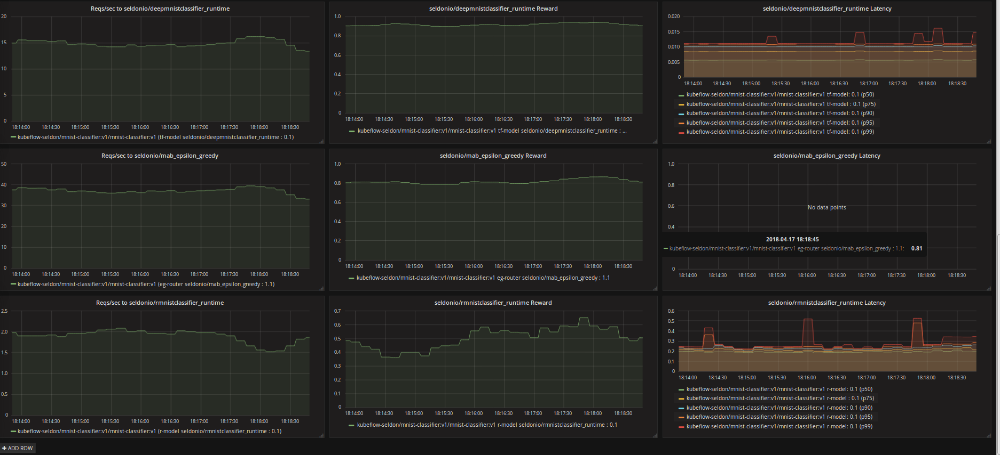

# Train and Deploy Machine Learning Models on Kubernetes with Kubeflow and Seldon-Core


Using:

 * [kubeflow](https://github.com/kubeflow/kubeflow)
 * [seldon-core](https://github.com/SeldonIO/seldon-core)

The example will be the MNIST handwritten digit classification task. We will train 3 different models to solve this task:

 * A TensorFlow neural network model.
 * A scikit-learn random forest model.
 * An R least squares model.

We will then show various rolling deployments

 1. Deploy the single Tensorflow model.
 2. Do a rolling update to an AB test of the Tensorflow model and the sklearn model.
 3. Do a rolling update to a Multi-armed Bandit over all 3 models to direct traffic in real time to the best model.


In the follow we will:

 1. [Install kubeflow and seldon-core on a kubernetes cluster](#setup)
 1. [Train the models](#train-the-models)
 1. [Serve the models](#serve-the-models)


# Requirements

 * gcloud
 * kubectl
 * ksonnet
 * argo


# Setup

  There is a consolidated script to create the demo which can be found [here](./scripts/README.md). For a step by step guide do the following:

  1. [Install kubeflow on GKE](https://www.kubeflow.org/docs/started/getting-started-gke/). This should create kubeflow in a namespace ```kubeflow```. We suggest you use the command line install so you can easily modify your Ksonnet installation. Ensure you have the environment variables `KUBEFLOW_SRC` and `KFAPP` set. OAUTH is preferred as with basic auth [port-forwarding to ambassador is insufficient](https://github.com/kubeflow/kubeflow/issues/3213)

  1. Install seldon. Go to your Ksonnet application folder setup in the previous step and run
      ```
      cd ${KUBEFLOW_SRC}/${KFAPP}/ks_app

      ks pkg install kubeflow/seldon
      ks generate seldon seldon
      ks apply default -c seldon
      ```
  1. Install Helm
      ```
      kubectl -n kube-system create sa tiller
      kubectl create clusterrolebinding tiller --clusterrole cluster-admin --serviceaccount=kube-system:tiller
      helm init --service-account tiller
      kubectl rollout status deploy/tiller-deploy -n kube-system
      ```
  1. Create an NFS disk and persistent volume claim called `nfs-1`. You can follow one guide on create an NFS volume using Google Filestore [here](https://cloud.google.com/community/tutorials/gke-filestore-dynamic-provisioning). A consolidated set of steps is shown [here](nfs.md)
  1. Add Cluster Roles so Argo can start jobs successfully
      ```
      kubectl create clusterrolebinding my-cluster-admin-binding --clusterrole=cluster-admin --user=$(gcloud info --format="value(config.account)")
      kubectl create clusterrolebinding default-admin2 --clusterrole=cluster-admin --serviceaccount=kubeflow:default
      ```
  1. Install Seldon Analytics Dashboard
      ```
      helm install seldon-core-analytics --name seldon-core-analytics --set grafana_prom_admin_password=password --set persistence.enabled=false --repo https://storage.googleapis.com/seldon-charts --namespace kubeflow
      ```
  1. Port forward the dashboard when running
      ```
      kubectl port-forward $(kubectl get pods -n kubeflow -l app=grafana-prom-server -o jsonpath='{.items[0].metadata.name}') -n kubeflow 3000:3000
      ```
  1. Visit http://localhost:3000/dashboard/db/prediction-analytics?refresh=5s&orgId=1 and login using "admin" and the password you set above when launching with helm.

# MNIST models

## Tensorflow Model

 * [Python training code](models/tf_mnist/train/create_model.py)
 * [Python runtime prediction code](models/tf_mnist/runtime/DeepMnist.py)
 * [Dockerfile to wrap runtime prediction code to run under seldon-Core](models/tf_mnist/runtime/Dockerfile).

## SKLearn Model

 * [Python training code](models/sk_mnist/train/create_model.py)
 * [Python runtime prediction code](models/sk_mnist/runtime/SkMnist.py)
 * [Dockerfile to wrap runtime prediction code to run under seldon-Core](models/sk_mnist/runtime/Dockerfile).

## R Model

 * [R training code](models/r_mnist/train/train.R)
 * [R runtime prediction code](models/r_mnist/runtime/mnist.R)
 * [Dockerfile to wrap runtime prediction code to run under seldon-Core](models/r_mnist/runtime/Dockerfile).

# Train the Models

 Follow the steps in [./notebooks/training.ipynb](./notebooks/training.ipynb) to:

 * Run Argo Jobs for each model to:
   * Creating training images and push to repo
   * Run training
   * Create runtime prediction images and push to repo
   * Deploy individual runtime model

**To push to your own repo the Docker images you will need to setup your docker credentials as a Kubernetes secret containing a [config.json](https://www.projectatomic.io/blog/2016/03/docker-credentials-store/). To do this you can find your docker home (typically ~/.docker) and run `kubectl create secret generic docker-config --from-file=config.json=${DOCKERHOME}/config.json --type=kubernetes.io/config` to [create a secret](https://kubernetes.io/docs/tasks/configure-pod-container/pull-image-private-registry/#registry-secret-existing-credentials).**

# Serve the Models

Follow the steps in [./notebooks/serving.ipynb](./notebooks/serving.ipynb) to:

 1. Deploy the single Tensorflow model.
 2. Do a rolling update to an AB test of the Tensorflow model and the sklearn model.
 3. Do a rolling update to a Multi-armed Bandit over all 3 models to direct traffic in real time to the best model.

To ensure the notebook can run successfully install the python dependencies:

```
pip install -r notebooks/requirements.txt
```

If you have [installed the Seldon-Core analytics](#setup) you can view them on the grafana dashboard:


